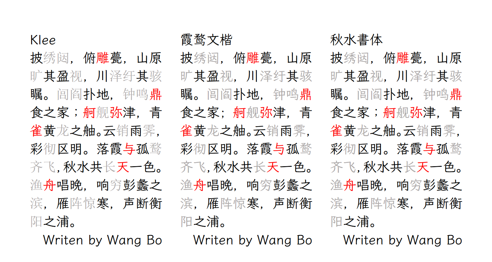

# QiushuiShotai / 秋水書体

An open-source Chinese font derived from Klee One and Ysabeau and LXGW WenKai. 一款开源中文字体，基于 Ysabeau、 Klee
One、霞鹜文楷衍生。

## 项目简介

作为一名日语专业的学生，我希望有一款在日文字形优先的基础上补全简体字的字体，满足学习语言这样比较特殊的中日文汉字混排的需要。

在偶然得知[魔兽世界字体合并/补全工具](https://github.com/nowar-fonts/Warcraft-Font-Merger)后，动手将 Ysabeau、 Klee
One、霞鹜文楷这 3 款字体合并，并获得不错的使用体验。抱着分享出来方便大家的想法，将项目开源在 GitHub。

出于表达我对霞鹜文楷制作者的敬意，也是为了沿用原项目的命名风格，斗胆用`落霞与孤鹜齐飞，秋水共长天一色`
的下半句来给这个字体起名「秋水書体」（英文名
QiushuiShotai）——秋水（Qiushui）表示该字体的简体中文字形来自霞鹜文楷；書体（Shotai）特意使用日文漢字字形和罗马音，表示这是一款以日文字形优先的教科書体。

## 字体预览

与原项目类似，本项目也有 2 个分支：

- QiushuiShotai/秋水書体：
  - [Klee](https://github.com/fontworks-fonts/Klee) 提供日文汉字字形和英文字形
  - [LxgwWenKai](https://github.com/lxgw/LxgwWenKai) 提供中文简体字字形
    
- QiushuiShotai Bright/秋水書体 Bright：
  - [Ysabeau](https://github.com/CatharsisFonts/Ysabeau)提供西文字形
  - [Klee](https://github.com/fontworks-fonts/Klee)提供日文汉字字形
  - [LxgwWenKai](https://github.com/lxgw/LxgwWenKai)提供中文简体字字形
    

另外，喜欢繁体字形的同学可以了解霞鹜文楷作者的 [Fusion Kai / 缝合楷](https://github.com/lxgw/FusionKai)项目的缝合楷 J 字体：

> 以日本标准字形优先，由「Klee One」「霞鹜文楷 TC」依次合并而成。

## 下载

1. 打开 [QiushuiShotai](QiushuiShotai) 或者 [QiushuiShotai Bright](QiushuiShotai%20Bright) 文件夹，下载所需要的格式即可
2. 123 盘：
   1. QiushuiShotai : <https://www.123pan.com/s/iGz0Vv-LodVh>
   2. QiushuiShotai Bright: <https://www.123pan.com/s/iGz0Vv-iodVh>

## 制作流程

本项目使用的字体文件来自以下开源项目：

[Ysabeau](https://github.com/CatharsisFonts/Ysabeau)：`YsabeauOffice-Regular.ttf`，提供西文字形

[Klee](https://github.com/fontworks-fonts/Klee)：`KleeOne-SemiBold.ttf`，提供日文汉字字形

[LxgwWenKai](https://github.com/lxgw/LxgwWenKai)：`LXGWWenKai-Regular.ttf`，提供中文简体字字形

使用的字体合并工具是[魔兽世界字体合并/补全工具](https://github.com/nowar-fonts/Warcraft-Font-Merger)

- 按住 Ctrl 键选中西文字体和日文字体文件
- 按住西文字体将多选的文件（即西文字体和日文字体）拖动到`合并.bat`，等待生成一个名为`out.ttf`的文件
- 按住 Ctrl 键选中上面生成的`out.ttf`和中文字体
- 按住`out.ttf`将多选的文件（即生成的日文字体和中文字体）拖动到`合并.bat`，等待生成新的`out.ttf`

需要注意的是这种方法合并的字体可能会在部分软件上遇到问题，请查看[魔兽世界字体合并/补全工具](https://github.com/nowar-fonts/Warcraft-Font-Merger)
的相关说明部分。

## 许可信息

### 许可

- 这款字体无论是个人还是企业都可以自由商用，无需付费，也无需知会或者标明原作者。
- 这款字体可以自由传播、分享，或者将字体安装于系统、软件或 APP 中也是允许的，可以与任何软件捆绑再分发以及／或一并销售。
- 这款字体可以自由修改、改造，制作衍生字体。修改或改造后的字体也必须同样以 SIL OFL 公开。

### 限制

在制作衍生字体时，字体名称不可使用原有字体的「保留名称」。本字体保留名称「秋水書体」「QiushuiShotai」，基于本字体二次衍生的字体，名称不可出现「秋水書体」或「QiushuiShotai」字样；而在没有对字体源代码进行修改的情况下，重新编译出来的字体，可以继续使用本字体的保留名称「秋水書体」「QiushuiShotai」。

- 根据 SIL Open Font License 1.1 的规定， 禁止单独出售字体文件(OTF/TTF 文件)的行为。
- 该字体不可在 SIL Open Font License 1.1 以外的授权许可下发行。

### 鸣谢

- [FONTWORKS 株式会社](http://fontworks.co.jp/)：提供原版开源字体
  Klee，[开发者 GitHub 主页](https://github.com/fontworks-fonts/)
- [lxgw](https://github.com/lxgw)：提供基于 Klee 补全简体汉字的霞鹜文楷字体
- [Nowar Typeface](https://github.com/nowar-fonts)：提供字体合并工具
